<!--
%\VignetteEngine{knitr}
%\VignetteIndexEntry{An Introduction to the hysteresis package}
-->

Hysteresis
========================================================
An R package for fitting rate-dependent hysteretic loops
-------------------------------------
Hysteresis loops occur when an output variable can have multiple possible values at one input value depending on the history of the system and the direction of change in the input. This package contains functions to simulate, fit, and obtain parameter values along with their standard errors (Yang and Parkhurst) from hysteresis loops of the form
$$x_{t}=b_{x}cos(2t\pi/T+\phi)+c_{x}+e_{x,t}$$
$$y_{t}=b_{y}*cos(2t\pi/T+\phi)^{n}+R*sin(2t\pi/T+\phi)^{m}+c_{y}+e_{y,t}$$

where e is a random error term. These generalized transcendental equations (Lapshin) form a hysteresis loop for a given frequency or period and set of time points t=1,2...n.

The plot below uses the function **mloop** which simulates hysteresis loops to show the effects of choosing various odd values for n and m.

```r
library(knitr)
library(hysteresis)
par(mfrow = c(3, 3), mai = c(0, 0.2, 0.2, 0), ann = FALSE, xaxt = "n", yaxt = "n", 
    oma = c(0, 0, 3, 0))

for (i in c(1, 3, 15)) {
    for (j in c(1, 3, 15)) {
        obj <- mloop(m = i, n = j, n.points = 100, period = 99)
        plot(floop(obj$x, obj$y, m = i, n = j, period = 99), xlim = c(-0.8, 
            0.8), ylim = c(-0.8, 0.8))
        if (i == 1) 
            title(paste("n=", j, sep = ""))
        if (j == 1) 
            title(ylab = paste("m=", i, sep = ""), line = 0, cex.sub = 2)
    }
}
title("Hysteresis Loops for Odd Values of m and n", outer = TRUE)
```

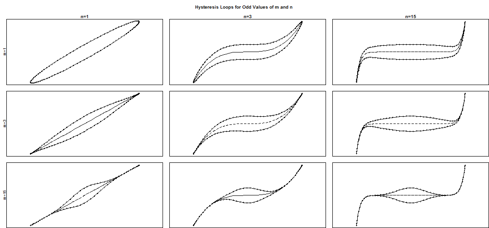 


It is also possible to use even values for n.


```r

par(mfrow = c(3, 3), mai = c(0, 0.2, 0.2, 0), ann = FALSE, xaxt = "n", yaxt = "n", 
    oma = c(0, 0, 3, 0))

for (i in c(1, 3, 15)) {
    for (j in c(2, 4, 16)) {
        obj <- mloop(m = i, n = j, n.points = 100, period = 99)
        plot(floop(obj$x, obj$y, m = i, n = j, period = 99), xlim = c(-0.8, 
            0.8), ylim = c(-0.8, 0.8))
        if (i == 1) 
            title(paste("n=", j, sep = ""))
        if (j == 2) 
            title(ylab = paste("m=", i, sep = ""), line = 0, cex.sub = 2)
    }
}
title("Hysteresis Loops for Odd Values of m and Even Values of n", outer = TRUE)
```

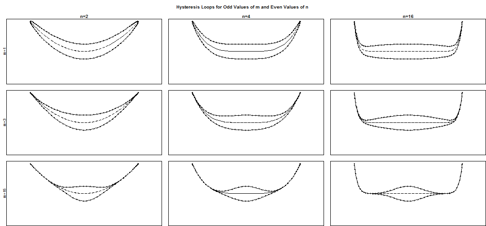 

A special case is when n=1 and m=1, this makes the hysteresis loop an ellipse. The centroid of the hysteresis loop is given by cx and cy as shown in the plot below of ellipses.

```r
obj <- mloop(cx = 0, cy = 0, n.points = 100, period = 99)
obj2 <- mloop(cx = 1.5, cy = 0, n.points = 100, period = 99)
obj3 <- mloop(cx = 0, cy = 1.5, n.points = 100, period = 99)
plot(obj$x, obj$y, type = "l", xlim = c(-2, 3), ylim = c(-2, 3), xlab = "x", 
    ylab = "y", col = "#6600CC", main = "Centroid Given by cx and cy")
points(0, 0, pch = 19, col = "#6600CC")
text(x = 0, y = 0.15, "(cx=0,cy=0)", col = "#6600CC")
lines(obj2$x, obj2$y, col = "#00FF66")
points(1.5, 0, pch = 19, col = "#00FF66")
text(x = 1.5, y = 0.15, "(cx=1.5,cy=0)", col = "#00FF66")
lines(obj3$x, obj3$y, col = "#FF6600")
points(0, 1.5, pch = 19, col = "#FF6600")
text(x = 0, y = 1.65, "(cx=0,cy=1.5)", col = "#FF6600")
```

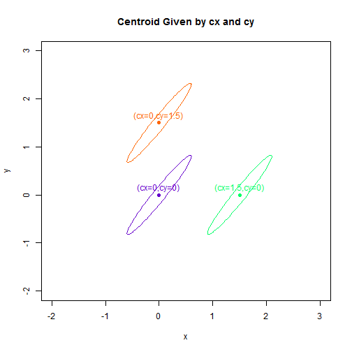 

The saturation points describe where the direction of the input changes sign. The distances from the central point to the saturation points are given by b.x and b.y (saturation points at ($c_{x} \pm b_{x},c_{y} \pm b_{y}$))

```r
for (i in c(1, 2, 4)) {
    obj <- mloop(b.x = i, n.points = 100, period = 99)
    plot(obj$x, obj$y, xlim = c(-5, 10), ylim = c(-1.4, 1.4), type = "l", main = paste("b.x=", 
        i, sep = ""), xlab = "x", ylab = "y")
    points(i, 0.8, pch = 19)
    legend(i, 1, legend = c("Saturation Point", "x=cx+b.x", "y=cy+b.y"), bty = "n")
}
```

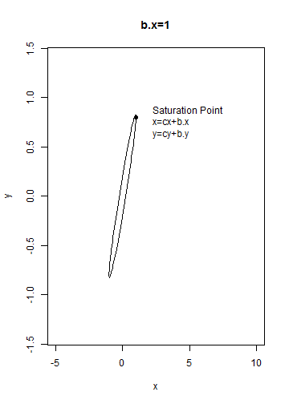 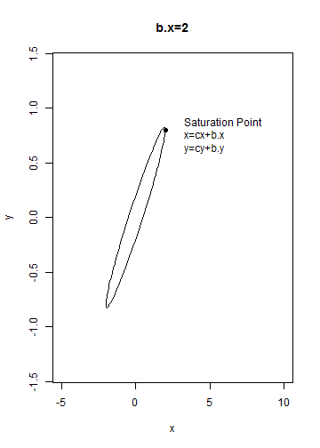 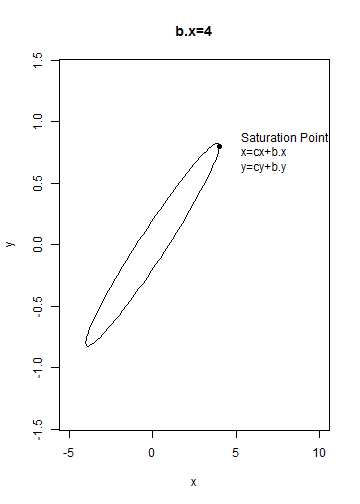 


```r
for (i in c(0.8, 2, 4)) {
    obj <- mloop(b.y = i, n.points = 100, period = 99)
    plot(obj$x, obj$y, xlim = c(-1, 2), ylim = c(-5, 5), type = "l", main = paste("b.y=", 
        i, sep = ""), xlab = "x", ylab = "y")
    points(0.6, i, pch = 19)
    legend(0.6, i, legend = c("Saturation Point", "x=cx+b.x", "y=cy+b.y"), bty = "n")
}
```

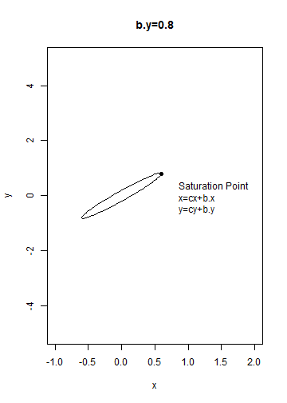 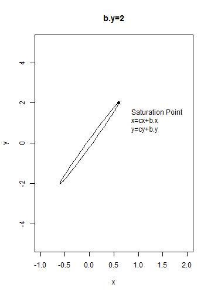 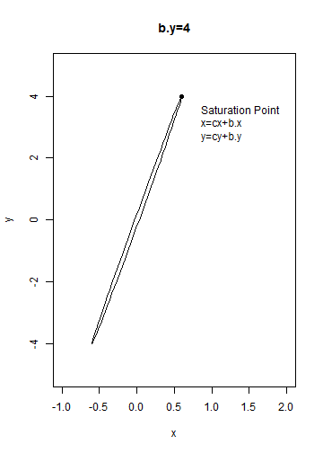 

Retention, or the output split point R, is the vertical distance from center to upper loop trajectory.

```r
for (i in c(1, 2, 4)) {
    obj <- mloop(retention = i, n.points = 100, period = 99)
    plot(obj$x, obj$y, xlim = c(-1, 1), ylim = c(-5, 5), type = "l", main = paste("retention=", 
        i, sep = ""), xlab = "x", ylab = "y")
    segments(0, 0, 0, i)
    text(0.3, 0.5, "Retention")
}
```

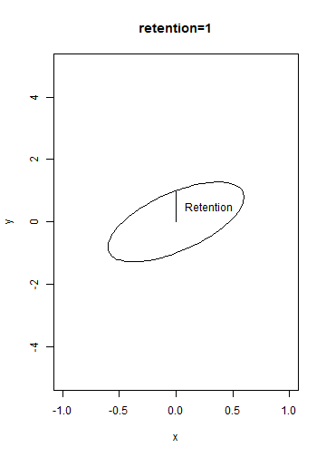 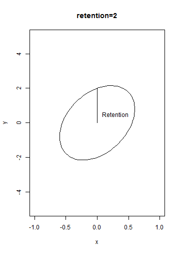 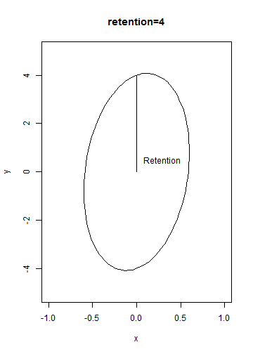 

Finally the phase.angle, $\phi$, changes the location of points along the loop, but does not change the form of the loop itself. When phase.angle is zero, the loop starting point is also the saturation point.

```r
obj <- mloop(retention = 0.5, n.points = 100, period = 99)
plot(obj$x, obj$y, type = "l", xlab = "x", ylab = "y", main = "Starting Points for Different Values of phase.angle", 
    xlim = c(-0.6, 0.8))
for (i in c(0, 90, 180, 260)) {
    obj2 <- mloop(phase.angle = i, retention = 0.5, n.points = 1, period = 99)
    points(obj2$x, obj2$y, pch = 19, col = "gold", cex = 2)
    points(obj2$x, obj2$y, col = "gold", cex = 4)
    text(obj2$x + 0.08, obj2$y, round(i, 2))
}
```

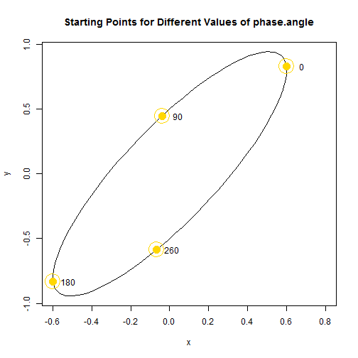 


Fitting Ellipses
----------------------
### The Process

**Hysteresis** contains one method for fitting hysteresis loops given any n and m in the function **floop**. 
In the special case of an ellipse where n=1 and m=1, four methods are available in the function **fel**. 
The two-step simple harmonic regression (harmonic2) method, the default, generally produces estimates that are less 
biased and have lower variances than those produced by the other methods. Since the focus is on rate-dependent hysteresis, 
knowledge of time for the observations is required (or if unknown, times may be assumed to be equally spaced). On the 
other hand, if the objective is solely to fit an ellipe, observation times are not needed for the other three methods.

```r
set.seed(24)
ellipse1 <- mel(method = 2, retention = 0.4, b.x = 0.6, b.y = 0.8, cx = 0, cy = 0, 
    sd.x = 0.1, sd.y = 0.1, phase.angle = 0, period = 24, n.points = 24)
# The function **mel** can be used as an alternative to **mloop** for
# simulating ellipses, and it is useful because it offers four different
# ellipse parameterizations.
model <- fel(ellipse1$x, ellipse1$y, method = "harmonic2", period = 24, times = "equal")
# period=24 and times='equal' are used to say that 24 equally spaced
# points make up an ellipse.
model
```

```
## Call:
## fel(x = ellipse1$x, y = ellipse1$y, method = "harmonic2", period = 24, 
##     times = "equal")
## 
## Delta Method Standard Errors and 95% C.I.'s:
##             Estimates    S.E.      low     high
## b.x           0.61175 0.02348  0.56242  0.66108
## b.y           0.82940 0.03389  0.75819  0.90061
## cx           -0.01377 0.01660 -0.04865  0.02111
## cy           -0.02789 0.02397 -0.07824  0.02247
## retention     0.42353 0.03389  0.35232  0.49474
## coercion      0.27821 0.02252  0.23090  0.32553
## area          0.81396 0.07224  0.66218  0.96574
## lag           1.80339 0.13902  1.51132  2.09546
## split.angle  53.58829 0.02678 53.53202 53.64456
## ampx          0.61175 0.02348  0.56242  0.66108
## ampy          0.93128 0.03389  0.86007  1.00248
## rote.deg     57.95687 1.53618 54.72947 61.18427
```

In addition to the fundamental values of the model, **fel** also calculates a wide variety of derived parameters. Definitions for these parameters can be found using **help(loop.parameters)**.

```r
model$Estimates
```

```
##          b.x          b.y  phase.angle           cx           cy 
##     0.611746     0.829397     0.009077    -0.013770    -0.027886 
##    retention     coercion         area          lag  split.angle 
##     0.423527     0.278211     0.813959     1.803394    53.588291 
## hysteresis.x hysteresis.y         ampx         ampy     rote.deg 
##     0.454782     0.510645     0.611746     0.931276    57.956870 
##   semi.major   semi.minor      focus.x      focus.y eccentricity 
##     1.088509     0.238024     0.563540     0.900344     0.975799
```

A wide variety of functions have S3 methods for objects of class **ellipsefit** produced by **fel**. The most important of these is **summary.ellipsefit** which can be used to bootstrap and summarize models produced by **fel**.

```r
summary(model, N = 10000, studentize = TRUE)
```

```
## Summary Call:
## summary.ellipsefit(object = model, N = 10000, studentize = TRUE)
## Call for Original Fit:
## fel(x = ellipse1$x, y = ellipse1$y, method = "harmonic2", period = 24, 
##     times = "equal")
## Ellipse Fitting Method:
## [1] "harmonic2"
## [1] "Two step simple harmonic least squares"
## 
## Bootstrapped Estimates:
##              Boot.Estimate       Bias Std.Error B.q0.025 B.q0.975
## b.x               0.611257  4.890e-04  0.025729  0.56099  0.66123
## b.y               0.829578 -1.814e-04  0.040574  0.74929  0.90935
## phase.angle       0.009612 -5.353e-04  0.041290 -0.07268  0.09004
## cx               -0.013768 -2.264e-06  0.017885 -0.04918  0.02197
## cy               -0.027827 -5.919e-05  0.025935 -0.07395  0.02739
## retention         0.423893 -3.658e-04  0.050428  0.32504  0.52259
## coercion          0.278577 -3.659e-04  0.033464  0.21309  0.34421
## area              0.813970 -1.098e-05  0.103135  0.61504  1.01537
## lag               1.804363 -9.691e-04  0.219718  1.37617  2.23905
## split.angle      53.641591 -5.330e-02  1.768993 50.03287 57.04299
## hysteresis.x      0.455761 -9.793e-04  0.051108  0.35328  0.55395
## hysteresis.y      0.508806  1.839e-03  0.073168  0.37459  0.66184
## ampx              0.611257  4.890e-04  0.025729  0.56099  0.66123
## ampy              0.930063  1.213e-03  0.036292  0.85909  1.00316
## rote.deg         57.940378  1.649e-02  1.656099 54.73290 61.19986
## rote.rad          1.011250  2.878e-04  0.028904  0.95527  1.06814
## semi.major        1.087134  1.375e-03  0.033710  1.02172  1.15601
## semi.minor        0.238329 -3.051e-04  0.029181  0.18151  0.29562
## focus.x           0.563723 -1.826e-04  0.027569  0.50780  0.61623
## focus.y           0.899537  8.067e-04  0.037667  0.82529  0.97416
## eccentricity      0.976133 -3.341e-04  0.006264  0.96201  0.98658
```

Another important S3 method is for the function **plot**.

```r

plot(model, main = "2-step Simple Harmonic Regression Ellipse Example")
```

 

In addition, S3 methods exist for **fitted**, **print**, and **residuals**.

### Comparison of Ellipse Estimation Methods

The two most useful ellipse estimation methods implemented by **fel** are the 'harmonic2' and 'direct' methods. The 'direct' method (Flusser and Halir) fits an ellipse without requiring time information and is more stable than the other two methods in **fel**, 'lm' and 'nls', which are based on linear least squares and ellipse-specific nonlinear regression respectively. The 'direct' method does not yet have delta method standard errors available.

```r
modeldirect <- fel(ellipse1$x, ellipse1$y, method = "direct", period = 24, times = "equal")
summodel <- summary(modeldirect, N = 10000, studentize = TRUE)
summodel
```

```
## Summary Call:
## summary.ellipsefit(object = modeldirect, N = 10000, studentize = TRUE)
## Call for Original Fit:
## fel(x = ellipse1$x, y = ellipse1$y, method = "direct", period = 24, 
##     times = "equal")
## Ellipse Fitting Method:
## [1] "direct"
## [1] "Direct specific least squares"
## 
## Bootstrapped Estimates:
##              Boot.Estimate       Bias Std.Error B.q0.025 B.q0.975
## b.x                0.64468 -0.0124559   0.03284   0.5711  0.69917
## b.y                0.84301 -0.0735491   0.07065   0.6327  0.91227
## cx                -0.09161 -0.0002028   0.03433  -0.1620 -0.02560
## cy                -0.13285 -0.0076761   0.05665  -0.2668 -0.04447
## retention          0.40156  0.0799485   0.06023   0.3809  0.61686
## coercion           0.28315  0.0522265   0.03729   0.2680  0.41471
## area               0.82182  0.1345457   0.10890   0.7609  1.18787
## lag                1.67428  0.4615269   0.31688   1.5924  2.84401
## split.angle       52.99576 -2.4039072   2.96911  44.3693 56.16428
## hysteresis.x       0.43435  0.0961164   0.06337   0.4161  0.66523
## hysteresis.y       0.43297  0.1927934   0.14559   0.4035  0.98150
## ampx               0.64468 -0.0124559   0.03284   0.5711  0.69917
## ampy               0.91815 -0.0104474   0.05552   0.8159  1.03364
## rote.deg          55.58649  1.1921900   2.80678  51.7237 62.62351
## rote.rad           0.97017  0.0208076   0.04899   0.9027  1.09299
## semi.major         1.10002 -0.0311347   0.05365   0.9754  1.18648
## semi.minor         0.23444  0.0503613   0.03461   0.2238  0.36020
## focus.x            0.60975 -0.0453029   0.04640   0.4691  0.65160
## focus.y            0.89267 -0.0308022   0.06286   0.7530  0.99955
## eccentricity       0.98281 -0.0189587   0.01498   0.9277  0.98663
```

```r
plot(modeldirect, main = "Direct Ellipse Example")
```

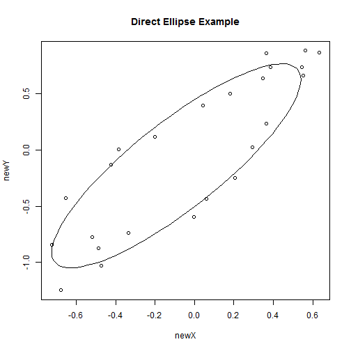 

The 'direct' method uses different fundamental parameters than the 'harmonic2' method. However summary results for b.x, b.y, and retention are still available from the matrix of  values produced by summary.ellipsefit.

```r
summodel$values
```

```
##              Orig.Estimate B.q0.025 B.q0.25   B.q0.5  B.q0.75 B.q0.975
## b.x                0.63223   0.5711  0.6094  0.63155  0.65358  0.69917
## b.y                0.76946   0.6327  0.7236  0.76813  0.81456  0.91227
## cx                -0.09181  -0.1620 -0.1140 -0.09154 -0.06877 -0.02560
## cy                -0.14053  -0.2668 -0.1750 -0.13433 -0.10090 -0.04447
## retention          0.48151   0.3809  0.4382  0.47456  0.51846  0.61686
## coercion           0.33538   0.2680  0.3092  0.33342  0.35913  0.41471
## area               0.95637   0.7609  0.8796  0.94860  1.02694  1.18787
## lag                2.13580   1.5924  1.9103  2.10434  2.33051  2.84401
## split.angle       50.59186  44.3693 48.7091 50.72233 52.57706 56.16428
## hysteresis.x       0.53047   0.4161  0.4857  0.52623  0.57146  0.66523
## hysteresis.y       0.62577   0.4035  0.5225  0.60230  0.70384  0.98150
## ampx               0.63223   0.5711  0.6094  0.63155  0.65358  0.69917
## ampy               0.90770   0.8159  0.8685  0.90087  0.94109  1.03364
## rote.deg          56.77868  51.7237 54.7981 56.56221 58.57629 62.62351
## rote.rad           0.99097   0.9027  0.9564  0.98720  1.02235  1.09299
## semi.major         1.06889   0.9754  1.0318  1.06484  1.10195  1.18648
## semi.minor         0.28480   0.2238  0.2604  0.28215  0.30647  0.36020
## focus.x            0.56445   0.4691  0.5348  0.56658  0.59562  0.65160
## focus.y            0.86186   0.7530  0.8186  0.85651  0.90018  0.99955
## eccentricity       0.96385   0.9277  0.9556  0.96604  0.97453  0.98663
##              Std.Error Boot.Mean       Bias Boot.Estimate
## b.x            0.03284   0.61977 -0.0124559       0.64468
## b.y            0.07065   0.69591 -0.0735491       0.84301
## cx             0.03433  -0.09202 -0.0002028      -0.09161
## cy             0.05665  -0.14821 -0.0076761      -0.13285
## retention      0.06023   0.56145  0.0799485       0.40156
## coercion       0.03729   0.38760  0.0522265       0.28315
## area           0.10890   1.09091  0.1345457       0.82182
## lag            0.31688   2.59733  0.4615269       1.67428
## split.angle    2.96911  48.18795 -2.4039072      52.99576
## hysteresis.x   0.06337   0.62658  0.0961164       0.43435
## hysteresis.y   0.14559   0.81856  0.1927934       0.43297
## ampx           0.03284   0.61977 -0.0124559       0.64468
## ampy           0.05552   0.89725 -0.0104474       0.91815
## rote.deg       2.80678  57.97087  1.1921900      55.58649
## rote.rad       0.04899   1.01178  0.0208076       0.97017
## semi.major     0.05365   1.03775 -0.0311347       1.10002
## semi.minor     0.03461   0.33516  0.0503613       0.23444
## focus.x        0.04640   0.51914 -0.0453029       0.60975
## focus.y        0.06286   0.83106 -0.0308022       0.89267
## eccentricity   0.01498   0.94489 -0.0189587       0.98281
```

The four plots below illustrate a comparison of the four methods for fitting an ellipse to simulated data. The data 
points are based on the simulated red ellipse; the fitted ellipse is in black.

```r
set.seed(13)
par(mfrow = c(2, 2))
halfellipse <- mel(method = 2, cx = 20, cy = 25, retention = 1.2, b.x = 14, 
    b.y = 0.8, sd.x = 1, sd.y = 0.2, period = 24, n.points = 16, phase.angle = pi/2)
halftrueellipse <- mel(method = 2, cx = 20, cy = 25, retention = 1.2, b.x = 14, 
    b.y = 0.8, phase.angle = 0, period = 99, n.points = 100)
harmodel <- fel(halfellipse$x, halfellipse$y, method = "harmonic2", period = 24, 
    times = "equal")
dirmodel <- fel(halfellipse$x, halfellipse$y, method = "direct", period = 24, 
    times = "equal")
lmmodel <- fel(halfellipse$x, halfellipse$y, method = "lm", period = 24, times = "equal")
nlsmodel <- fel(halfellipse$x, halfellipse$y, method = "nls", period = 24, times = "equal", 
    control = c(n.iter = 500))
plot(harmodel, main = "Harmonic2 Model", xlim = c(5, 34), ylim = c(23.4, 26.9))
lines(halftrueellipse$x, halftrueellipse$y, col = "red")
plot(dirmodel, main = "Direct Model", xlim = c(5, 34), ylim = c(23.4, 26.9))
lines(halftrueellipse$x, halftrueellipse$y, col = "red")
plot(lmmodel, main = "Linear Model", xlim = c(5, 34), ylim = c(23.4, 26.9))
lines(halftrueellipse$x, halftrueellipse$y, col = "red")
plot(nlsmodel, main = "Non-Linear Model", xlim = c(5, 34), ylim = c(23.4, 26.9))
lines(halftrueellipse$x, halftrueellipse$y, col = "red")
```

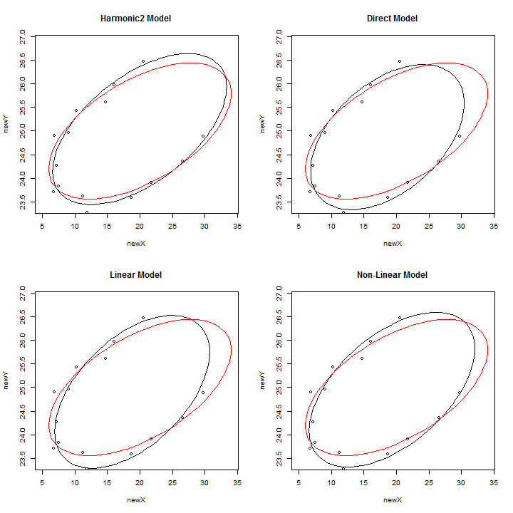 


Bootstrapping Fitted Ellipses
----------------------------------

The function **summary.ellipsefit** bootstraps the x and y residuals of a fitted ellipse separately to produce 
standard errors and less biased estimates of ellipse parameters. These residuals are easy to obtain using the 
'harmonic2' model which gives fitted points when fitting the ellipse, but somewhat more difficult to obtain from the 
other methods which do not use time as a variable in fitting the model and therefore cannot place observations on the 
ellipse. The function **fel**, therefore, gives two methods for producing x and y residuals using these methods. If 
times="unknown", fitted values are taken to be the points on the ellipse closest to their realized values. If 
times="equal" or a numeric vector and the period of the ellipse is known, then the distances between points on the 
ellipse are taken as given and only the starting point of the ellipse is chosen to minimize the sum of squared distances 
between fitted and realized values. If times are available, it is always better to give them, as the residuals given 
by times='unknown' will lead to standard errors for ellipse parameters that are biased downwards. If times really are 
unknown, a good alternative is to use the delta standard errors from the function **delta.error** which is currently 
available for every method except the direct.

In addition, residuals can be studentized within the **summary.ellipsefit** function by keeping studentize=TRUE, which is the default. Simulations suggest that studentization improves 95% bootstrap coverage intervals for all four methods.

The value N gives the number of bootstrap replicates, its default is 1000 which may be  low in some situations (Efron).
In each replication, residuals are resampled with replacement and added to the original fitted values produced by **fel**. The simulated ellipse is then refit using the original method and parameter estimates are obtained. The standard deviations of these estimates are then used to give parameter standard errors, and less biased parameter estimates are obtained by subtracting the estimated bias produced by the method, mean(bootstrap estimates) - (original estimate), from the original estimate.
Note, if reproducable results are desired use set.seed() command.
### Comparison of Bootstrapped Ellipses

The fitted black ellipses from above are then bootstrapped to reduce bias.

```r
par(mfrow = c(2, 2))
harsummodel <- summary(harmodel, N = 1000, studentize = TRUE)
dirsummodel <- summary(dirmodel, N = 1000, studentize = TRUE)
```

```
## Warning: Bootstrapped rote.deg values on both sides of 0, 180 degrees.
```

```r
lmsummodel <- summary(lmmodel, N = 1000, studentize = TRUE)
nlssummodel <- summary(nlsmodel, N = 1000, studentize = TRUE)
```

```
## Warning: The function nls failed to converge 558 times.
```

```r
plot(harsummodel, main = "Bootstrapped Harmonic2 Model", xlim = c(5, 34), ylim = c(23.4, 
    26.9))
lines(halftrueellipse$x, halftrueellipse$y, col = "red")
plot(dirsummodel, main = "Bootstrapped Direct Model", xlim = c(5, 34), ylim = c(23.4, 
    26.9))
lines(halftrueellipse$x, halftrueellipse$y, col = "red")
plot(lmsummodel, main = "Bootstrapped Lm Model", xlim = c(5, 34), ylim = c(23.4, 
    26.9))
lines(halftrueellipse$x, halftrueellipse$y, col = "red")
plot(nlssummodel, main = "Bootstrapped Nls Model", xlim = c(5, 34), ylim = c(23.4, 
    26.9))
lines(halftrueellipse$x, halftrueellipse$y, col = "red")
```

 


Fitting Multiple Ellipses Simultaneously
------------------------------------------

The argument subjects in the function **fel** can be used to fit multiple ellipses, which share the same period, 
at one time. In this case **fel** produces an object of class **ellipsefitlist** instead of **ellipsefit**, and methods for 
objects of class **ellipsefitlist** exist for the functions **summary**, **plot**, and **print**. Ellipses are separated 
by levels given by the argument subjects, which can be either a vector or a list of vectors treated as factors. Below 
is an example of fitting multiple ellipses using the subjects option.


```r
data(EllipseData)
models <- fel(EllipseData$X, EllipseData$Y, method = "harmonic2", subjects = EllipseData$subjects, 
    subset = EllipseData$repeated == 1)
models
```

```
## Call:
## fel(x = EllipseData$X, y = EllipseData$Y, method = "harmonic2", 
##     subjects = EllipseData$subjects, subset = EllipseData$repeated == 
##         1)
## 
## Parameter Estimates:
##          cx        cy    b.x    b.y phase.angle retention   area   lag
## A -0.020698 -0.019671 0.5737 0.7912      -4.696    0.3762 0.6781 1.695
## B  0.018284 -0.007562 0.5503 0.8479       1.523    0.8172 1.4127 2.930
## C -0.004129 -0.015904 0.9990 0.8181      -4.677    0.4144 1.3006 1.791
##   coercion rote.rad rote.deg semi.major semi.minor split.angle
## A   0.2464   1.0104    57.89      1.026     0.2104       54.06
## B   0.3819   1.2154    69.64      1.249     0.3601       57.02
## C   0.4514   0.7375    42.26      1.319     0.3138       39.31
##   hysteresis.x hysteresis.y   ampx   ampy focus.x focus.y eccentricity
## A       0.4294       0.4755 0.5737 0.8761  0.5337  0.8505       0.9787
## B       0.6940       0.9638 0.5503 1.1776  0.4161  1.1212       0.9575
## C       0.4519       0.5066 0.9990 0.9170  0.9484  0.8617       0.9713
## 
## Delta Method Standard Errors:
##       b.x     b.y      cx      cy retention coercion    area     lag
## A 0.03591 0.03035 0.02539 0.02146   0.03035  0.02366 0.06923 0.13231
## B 0.02605 0.02935 0.01842 0.02075   0.02935  0.02060 0.08394 0.09519
## C 0.02949 0.02961 0.02085 0.02093   0.02961  0.03171 0.10053 0.12331
##   split.angle    ampx    ampy rote.deg
## A     0.03489 0.03591 0.03035    3.291
## B     0.02678 0.02605 0.02935    1.440
## C     0.02289 0.02949 0.02961    2.554
```

```r
summodels <- summary(models)
summodels
```

```
## Summary Call:
## summary.ellipsefitlist(object = models)
## Call for Original Fit:
## FUN(x = data[x, , drop = FALSE], method = ..1, period = ..2, 
##     times = ..3, na.action = ..4, control = ..5)
## Ellipse Fitting Method:
## [1] "harmonic2"
## [1] "Two step simple harmonic least squares"
## 
## Bootstrapped Value Estimates:
##       Parameter Subject Boot.Estimate       Bias Std.Error B.q0.025
## 1           b.x       A      0.572922  7.492e-04  0.038194  0.50191
## 2           b.y       A      0.793403 -2.193e-03  0.043134  0.70384
## 4            cx       A     -0.020312 -3.863e-04  0.028548 -0.07507
## 5            cy       A     -0.019794  1.230e-04  0.023149 -0.06354
## 6     retention       A      0.380276 -4.034e-03  0.064851  0.24923
## 7      coercion       A      0.248425 -2.065e-03  0.044503  0.15984
## 8          area       A      0.684393 -6.315e-03  0.125196  0.43392
## 9           lag       A      1.707085 -1.159e-02  0.308054  1.12046
## 11 hysteresis.x       A      0.433578 -4.132e-03  0.072624  0.29037
## 12 hysteresis.y       A      0.475400  1.275e-04  0.100211  0.29861
## 13         ampx       A      0.572922  7.492e-04  0.038194  0.50191
## 14         ampy       A      0.876981 -8.695e-04  0.033160  0.81263
## 15     rote.deg       A     57.921263 -3.069e-02  2.134167 53.85934
## 17   semi.major       A      1.025899 -3.155e-05  0.035962  0.95960
## 18   semi.minor       A      0.212320 -1.923e-03  0.038378  0.13508
## 19      focus.x       A      0.533651  4.494e-05  0.040064  0.45653
## 20      focus.y       A      0.851832 -1.358e-03  0.034924  0.78408
## 21 eccentricity       A      0.979194 -4.515e-04  0.008141  0.95892
## 22          b.x       B      0.549803  4.670e-04  0.027784  0.49497
## 23          b.y       B      0.847117  7.366e-04  0.051842  0.74955
## 25           cx       B      0.018221  6.291e-05  0.019937 -0.01891
## 26           cy       B     -0.006217 -1.344e-03  0.022215 -0.05333
## 27    retention       B      0.820215 -3.016e-03  0.053005  0.71270
## 28     coercion       B      0.383066 -1.195e-03  0.029369  0.32690
## 29         area       B      1.416718 -4.008e-03  0.115915  1.19262
## 30          lag       B      2.938387 -8.703e-03  0.215890  2.54035
## 32 hysteresis.x       B      0.696718 -2.747e-03  0.040704  0.61806
## 33 hysteresis.y       B      0.962239  1.605e-03  0.110468  0.77897
## 34         ampx       B      0.549803  4.670e-04  0.027784  0.49497
## 35         ampy       B      1.177249  3.204e-04  0.032670  1.11208
## 36     rote.deg       B     69.662709 -2.514e-02  1.485583 66.74539
## 38   semi.major       B      1.248044  8.865e-04  0.032264  1.18659
## 39   semi.minor       B      0.361339 -1.287e-03  0.027881  0.30822
## 40      focus.x       B      0.415521  6.030e-04  0.030542  0.36071
## 41      focus.y       B      1.120842  3.321e-04  0.035015  1.04888
## 42 eccentricity       B      0.957540  3.672e-06  0.007059  0.94250
## 43          b.x       C      0.997340  1.628e-03  0.032970  0.93429
## 44          b.y       C      0.817568  4.910e-04  0.034700  0.75266
## 46           cx       C     -0.002751 -1.379e-03  0.022439 -0.04791
## 47           cy       C     -0.014699 -1.206e-03  0.023006 -0.05883
## 48    retention       C      0.416848 -2.432e-03  0.040703  0.33783
## 49     coercion       C      0.453515 -2.075e-03  0.044135  0.36167
## 50         area       C      1.306140 -5.557e-03  0.134540  1.05269
## 51          lag       C      1.800917 -9.846e-03  0.178839  1.44627
## 53 hysteresis.x       C      0.454700 -2.794e-03  0.041753  0.37005
## 54 hysteresis.y       C      0.508425 -1.841e-03  0.059006  0.39669
## 55         ampx       C      0.997340  1.628e-03  0.032970  0.93429
## 56         ampy       C      0.916693  3.469e-04  0.031881  0.85715
## 57     rote.deg       C     42.295296 -3.828e-02  1.521314 39.37399
## 59   semi.major       C      1.317340  1.911e-03  0.032742  1.25551
## 60   semi.minor       C      0.315592 -1.787e-03  0.031515  0.25127
## 61      focus.x       C      0.946686  1.713e-03  0.034851  0.88060
## 62      focus.y       C      0.861311  3.663e-04  0.033875  0.80051
## 63 eccentricity       C      0.971251  4.700e-05  0.006042  0.95864
##    B.q0.975
## 1   0.64950
## 2   0.87421
## 4   0.03180
## 5   0.02559
## 6   0.50613
## 7   0.33331
## 8   0.91639
## 9   2.28972
## 11  0.56581
## 12  0.67876
## 13  0.64950
## 14  0.94342
## 15 61.92684
## 17  1.09876
## 18  0.28682
## 19  0.61503
## 20  0.91919
## 21  0.99214
## 22  0.60778
## 23  0.94344
## 25  0.05689
## 26  0.03348
## 27  0.91746
## 28  0.43739
## 29  1.63768
## 30  3.33859
## 32  0.76821
## 33  1.18797
## 34  0.60778
## 35  1.24000
## 36 72.46879
## 38  1.31291
## 39  0.41471
## 40  0.47633
## 41  1.18748
## 42  0.97009
## 43  1.06329
## 44  0.88884
## 46  0.03867
## 47  0.03102
## 48  0.49491
## 49  0.53806
## 50  1.56629
## 51  2.14359
## 53  0.53281
## 54  0.62686
## 55  1.06329
## 56  0.98378
## 57 45.31143
## 59  1.38234
## 60  0.37467
## 61  1.01916
## 62  0.92967
## 63  0.98176
```

```r
plot(summodels, main = "Fitting Multiple Ellipses Simultaneously")
```

   


To output summary results to excel readable file at current directory
----------------------------------------------------------------------


```r
## write.table(models$Estimates,'file_name.txt') and
## write.table(summodels$Boot.Estimates,'file_name.txt')
```


Fitting Hysteresis Loops
--------------------------

The function **floop** can be used to fit hysteresis loops with specific values of n and m as arguments to **floop**. Below is an example of a 
hysteresis loop with n=5, m=3. 

```r
loop <- mloop(n = 5, m = 3, sd.x = 0.02, sd.y = 0.02)
fitloop <- floop(loop$x, loop$y, n = 5, m = 3, period = 24, times = "equal")
fitloop$Estimates
```

```
##                n                m              b.x              b.y 
##         5.000000         3.000000         0.597218         0.784442 
##      phase.angle               cx               cy        retention 
##         0.244676        -0.002751        -0.003816         0.185858 
##         coercion             area              lag beta.split.angle 
##         0.314252         0.261532         0.888619         0.000000 
##     hysteresis.x     hysteresis.y 
##         0.526193         0.236930
```

```r
plot(fitloop, main = "Fitted Hysteresis Loop")
```

 

```r
summary(fitloop)
```

```
## Summary Call:
## summary.fittedloop(object = fitloop)
## Call for Orixinal Fit:
## floop(x = loop$x, y = loop$y, n = 5, m = 3, times = "equal", 
##     period = 24)
## 
## Bootstrapped Estimates:
##                  Boot.Estimate       Bias Std.Error  B.q0.025 B.q0.975
## b.x                   0.596826  3.927e-04  0.004981  0.587315 0.606860
## b.y                   0.784311  1.305e-04  0.009713  0.765790 0.802667
## phase.angle           0.489501 -2.448e-01  0.008335  0.228805 0.260500
## cx                   -0.002780  2.918e-05  0.003512 -0.009807 0.003843
## cy                   -0.003672 -1.440e-04  0.004748 -0.012928 0.005314
## retention             0.185523  3.346e-04  0.008448  0.169436 0.202769
## coercion              0.313988  2.647e-04  0.004576  0.305044 0.323426
## area                  0.260884  6.478e-04  0.012204  0.238265 0.286791
## lag                   0.887171  1.448e-03  0.040801  0.809299 0.970199
## beta.split.angle      0.000000  0.000e+00  0.000000  0.000000 0.000000
## hysteresis.x          0.526099  9.429e-05  0.006033  0.514109 0.537917
## hysteresis.y          0.236501  4.291e-04  0.011287  0.215070 0.259580
```


Acknowledgments
-----------------

NIFA MRF 25-008/W-2173 Impacts of Stress Factors on Performance, Health, and Well Being of Farm Animals
